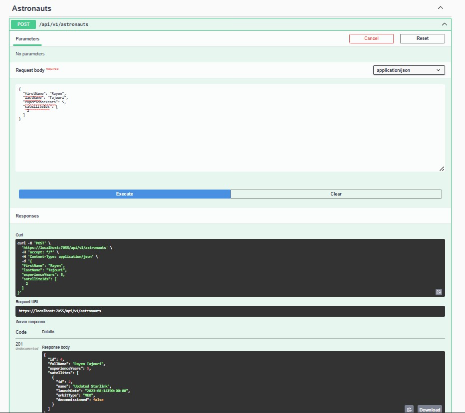
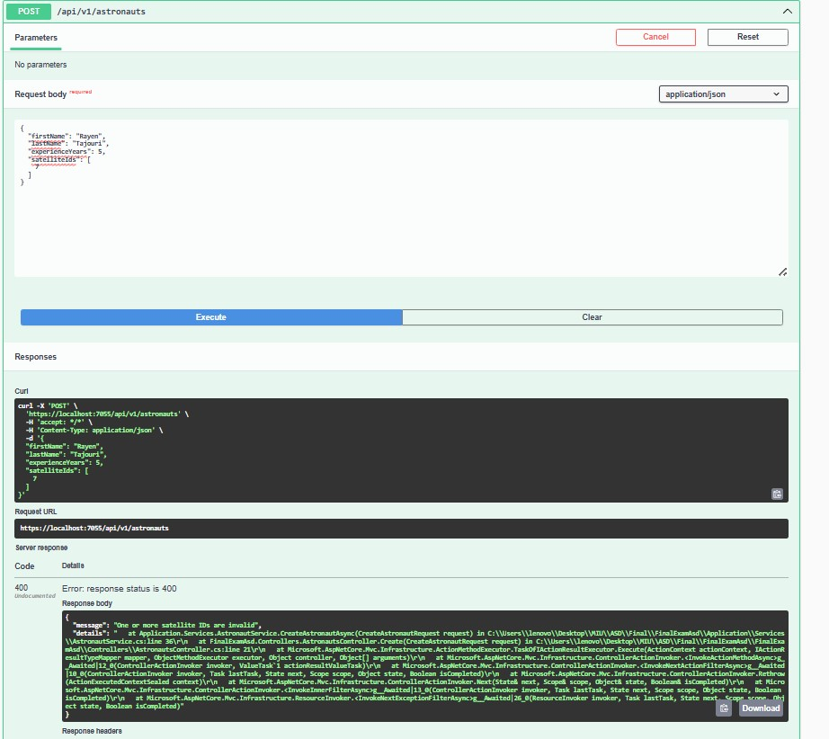
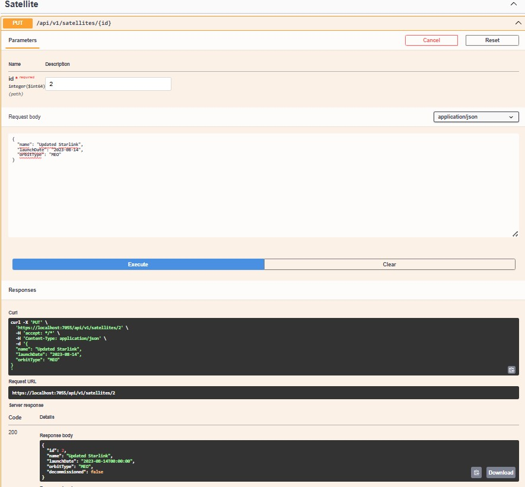
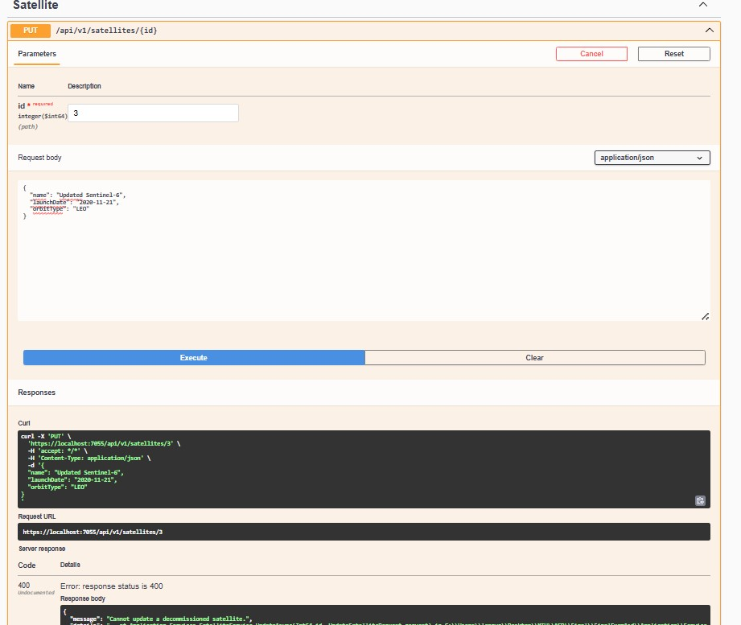
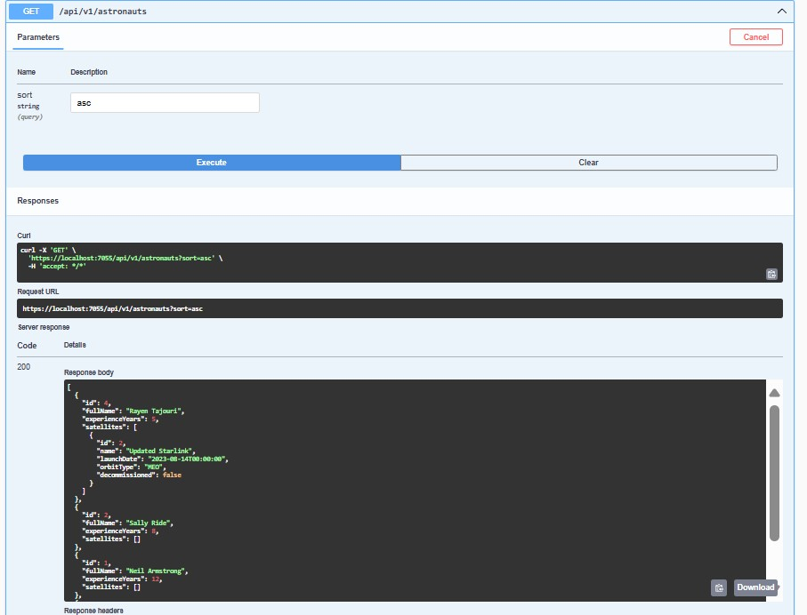
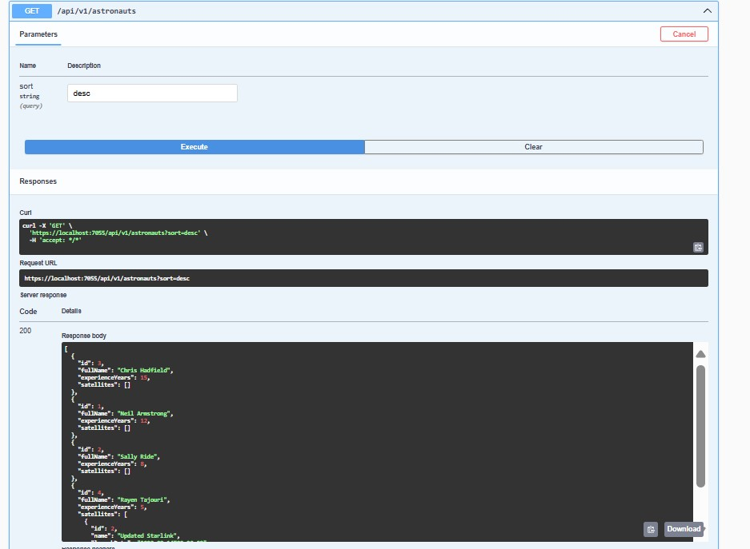
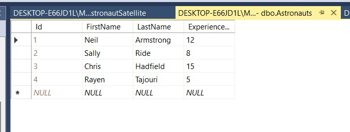
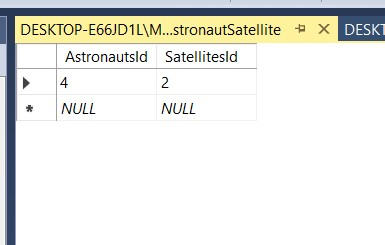
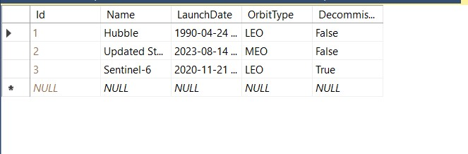

## API Examples

### ✅ Create Astronaut

### ❌ Create Astronaut Exception

### 🔄 Update Satellite (Success)

### ❌ Update Satellite (Fail - Decommissioned)

### ✅ Get Astronaut ASC (Success)

### ✅ Get Astronaut DESC (Success)

### 📊 Database Validation

